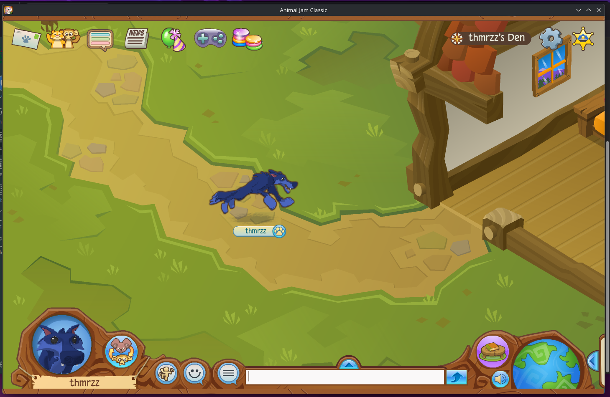

# AJCEverywhere
> [!NOTE]
> This project is no longer actively maintained. I am going to be working on another
> Electron-compatible runtime. I will be making another, much lighterweight runtime
> in the future, and it will probably use concepts from this one. But for now,
> I am taking a break.



AJCEverywhere is a native installer, updater, and launcher for [AJ Classic](https://classic.animaljam.com) for operating systems beside Windows/macOS. Unlike other third-party clients, AJCEverywhere aims to provide a *semi-official* experience by using the bundle from the official Windows client.

## Features
* Uses part of the official client
* Supports automatic updates to game and launcher
* Fast, native performance on Linux
* Compatible with Raspberry Pi 4 and 5

## How to install (Arch only)
You can easily install AJCEverywhere on Arch Linux through the AUR.
```bash
yay -S ajceverywhere-bin
```
To start AJCEverywhere, run either the `aj-classic` or the `ajceverywhere` command.

## Folder structure
* `img`: Screenshots + AJ Classic icon
* `src`: The source code
* `util`: Installers, desktop entry, pkgbuild, etc.

## Roadmap to final release
✅ Get AJCE working<br>
✅ Rename project to `AJCEverywhere`<br>
✅ Add support for auto-updating the game<br>
✅ Add support for updating the launcer<br>
~~❌ Create the proper installing screen (`splash/update.htm`)<br>~~
~~❌ Refactor `config.js` into new platform-specific format<br>~~
~~❌ Add support for using the the user's Flash installation<br>~~
~~❌ Refactor the entire project yet again<br>~~
~~❌ Allow AJC to control updates via `electron-updater`<br>~~
~~❌ Rewrite the entire thing in Rust as an Electron-compatible web browser engine~~<br>

## FAQ
### Is AJCEverywhere open-source?
Yes, AJCEverywhere is fully open-source. AJCEverywhere is licensed under a custom license; you can read it in [LICENSE.md](LICENSE.md).

### How good is the performance?
The performance is pretty good, even on low-end devices like Raspberry Pis. It performs just as well as the native Windows version, and almost always outperforms WINE.

### If this is "native", why is it written in Electron?
AJ Classic is written in a combination of Electron and Flash (but mostly Flash). By "native", we mean that we're using the native versions of Electron and Flash instead of running the Windows versions through a comaptibility layer like WINE.

### What does "semi-official" mean?
AJCEverywhere isn't a client; it's a runtime. Instead of emulating AJ Classic, it downloads the bundle for the official Windows apps and runs it, without making any actual changes to the files. While the client itself is 100% official, the launcher and runtime itself (AJCEverywhere) *isn't* supported by AJHQ or WildWorks. This does NOT mean that AJCEverywhere is officially supported; it only means that it uses the official game bundle for window.

### Is Windows supported?
Not yet, but we're actively working on Windows support. Stay tuned for more updates.

### Why does it hang on the updater?
Sometimes, managed networks block it from installing flash. You'll need the Internet Archive to be unblocked to install this on x64 systems, and GitHub to be unblocked to install it on ARM-based systems. If all else fails, manually copy a `libpepflashplayer.so` file to the PKG folder.

### Where is the PKG folder?
If you install it via AUR or a package manager, or installed it system-wide, it'll be located at `/usr/lib/ajceverywhere/resources/app/unsafe/pkg`. If you install it via the AppImage installer, it'll be located in `~/.local/ajceverywhere/resources/app/pkg`. If you install it manually, you can find it in the `./resources/app/pkg` folder.
